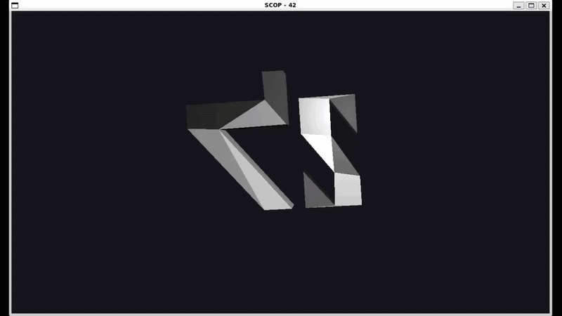
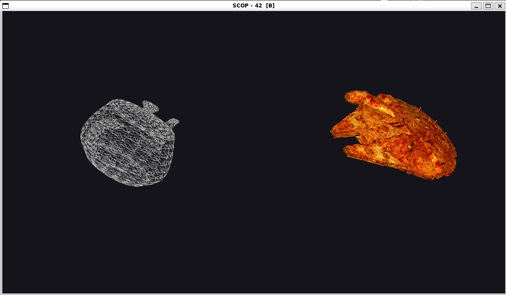
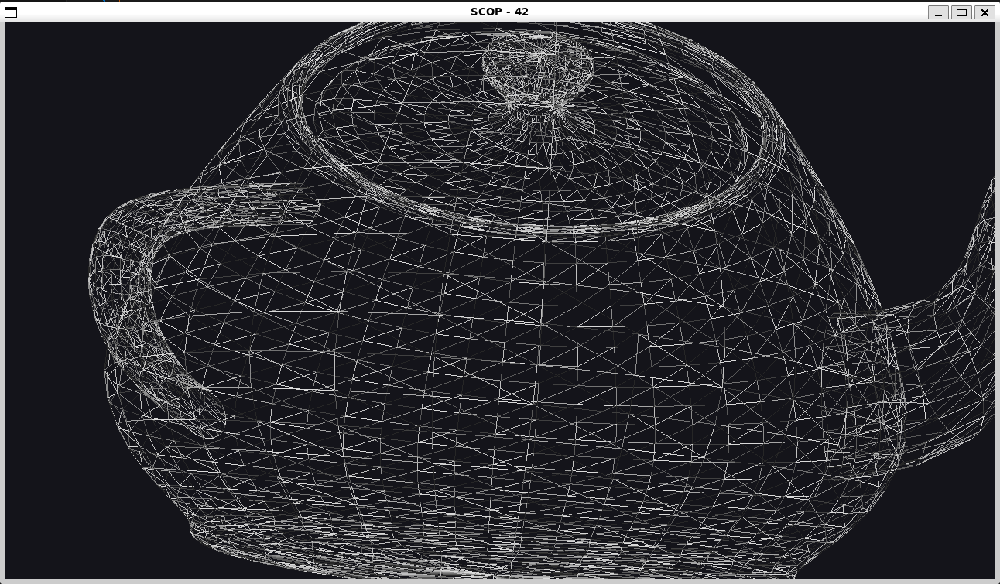
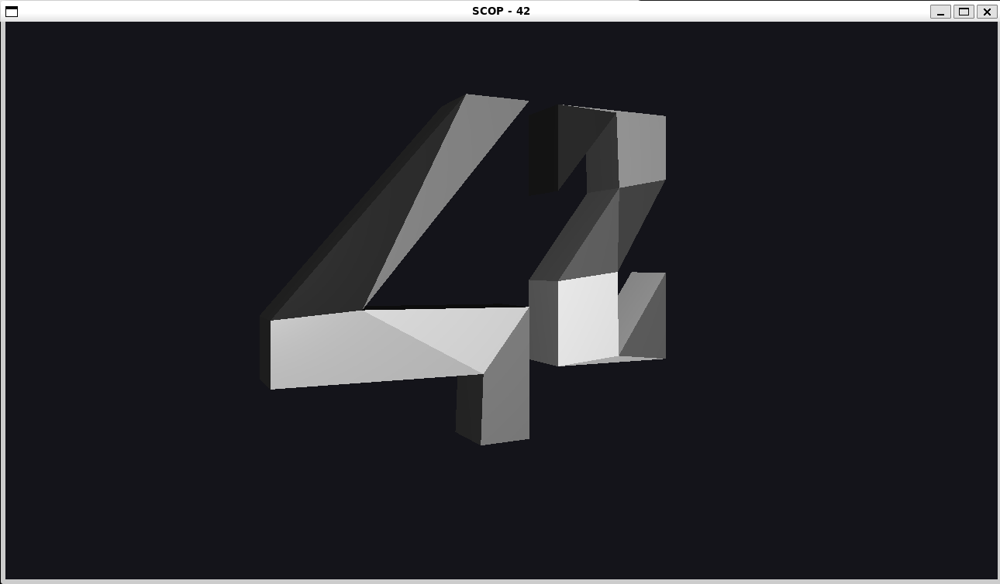
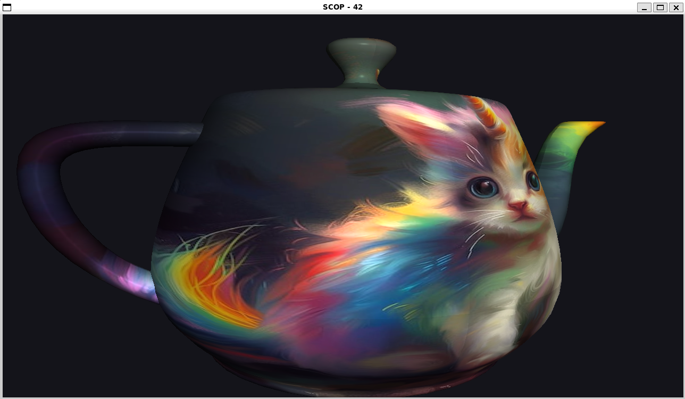
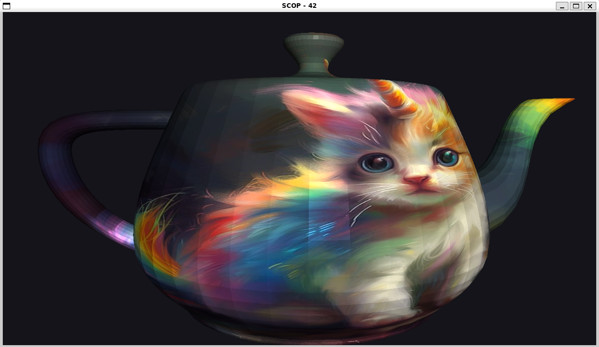
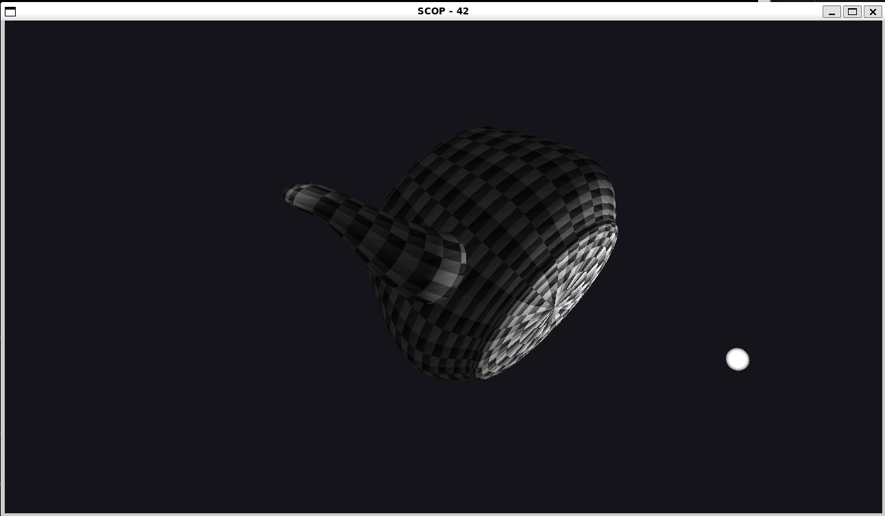

# scop-42# SCOP — 3D Object Viewer

> A 3D `.obj` viewer built entirely from scratch in **C# (.NET 8)** using **OpenGL 4.1 Core Profile**.  
> All math, OBJ parsing, triangulation, UV mapping, and texture loading are hand-rolled — no external libraries.

---

## Preview

### Mandatory — 42 logo spinning with texture
<!-- Replace with your gif -->


### Bonus — Teapot with Phong lighting and smooth shading
<!-- Replace with your gif -->


### Dual model side by side
<!-- Replace with your screenshot -->


### Wireframe mode
<!-- Replace with your screenshot -->


---

## Build

```bash
make        # build
make re     # clean + build
make clean  # remove build artifacts
make fclean # remove build + binary
```

Requires **.NET 8 SDK** and **OpenTK 4** (fetched automatically via NuGet on first build).

---

## Usage

```bash
# Single model
./scop <model.obj> [texture.bmp|texture.ppm]

# Single model with bonus algorithms
./scop <model.obj> [texture] --bonus

# Dual model side by side
./scop <model1.obj> <texture1> <model2.obj> <texture2>

# Dual model with bonus algorithms
./scop <model1.obj> <texture1> <model2.obj> <texture2> --bonus
```

### `--bonus` flag
Switches the OBJ parsing pipeline from the mandatory algorithms to the bonus ones:

| | Standard | `--bonus` |
|---|---|---|
| Triangulation | Fan (convex only) | Ear-clipping (concave + non-planar) |
| UV mapping | Box projection (XY plane) | Face-normal projection (per-face dominant axis) |

---

## Controls

| Input | Action |
|---|---|
| `Arrow keys` | Translate on X / Y |
| `Q` / `E` | Translate on Z (closer / farther) |
| `T` | Toggle texture (smooth animated blend) |
| `W` | Wireframe toggle |
| `C` | Backface culling toggle |
| `S` | Flat / smooth shading toggle |
| `L` | Phong lighting toggle |
| `P` | Save screenshot as `.ppm` in working directory |
| `Tab` | Switch active model (dual mode only) |
| `Scroll` | Zoom in / out |
| `LMB drag` | Rotate model |
| `RMB hold` | Show and move light source |
| `RMB hold + Scroll` | Move light on Z axis |
| `ESC` | Quit |

---

## Features

### Mandatory
- `.obj` parsing — hand-rolled, supports `v`, `vt`, `vn`, `f` (with negative indices)
- Perspective projection with hand-rolled `Mat4`
- Auto-rotation around the geometric centroid
- Per-face gray shading (8-shade palette)
- Movement on all 3 axes
- Texture toggle with smooth animated blend (`mix` in GLSL)
- Hand-rolled texture loading (BMP and PPM formats)
- Hand-rolled GLSL shader loading and compilation

### Bonus
| # | Feature | Key |
|---|---|---|
| 1 | Wireframe toggle | `W` |
| 2 | Backface culling | `C` |
| 3 | Auto-scaling on load | automatic |
| 4 | Screenshot to PPM | `P` |
| 5 | Flat vs smooth shading | `S` |
| 6 | Phong lighting + moveable light source | `L` + RMB |
| 7 | Dual model side by side | pass 4 args |
| 8 | Smart UV mapping (face-normal projection) | `--bonus` |
| 9 | Ear-clipping triangulation | `--bonus` |

---

## Architecture

```
Program.cs          entry point, argument parsing
App.cs              GameWindow subclass, thin orchestrator
AppState.cs         all shared runtime state
ModelState.cs       per-model independent state (one per loaded model)
InputHandler.cs     keyboard + mouse input, mutates AppState / ModelState
Renderer.cs         builds MVP matrices, sets uniforms, draw calls

src/Math/
  Vec2 / Vec3 / Vec4 / Mat4     hand-rolled math, column-major

src/Parsing/
  ObjParser.cs                  .obj parser — centroid centering, auto-scale
  Vertex.cs                     interleaved struct: pos(3) + col(3) + uv(2) + normal(3)
  Interfaces/
    ITriangulator               Strategy pattern
    IUvMapper                   Strategy pattern
  Triangulation/
    FanTriangulator             mandatory — fan method, convex faces
    EarClipper                  bonus — ear-clipping, concave + non-planar
  UvMapping/
    BoxUvMapper                 mandatory — global XY projection
    FaceNormalUvMapper          bonus — dominant axis per face

src/Rendering/
  Shader.cs                     GLSL load / compile / link / uniform cache
  Mesh.cs                       VAO / VBO / EBO upload + Draw()
  LightSphere.cs                procedural UV sphere for light visualisation
  Texture.cs                    Factory: loads BMP / PPM, uploads to GPU
  NullTexture.cs                Null Object: silent no-op when no texture

shaders/
  vertex.glsl                   MVP transform, normal to world space
  fragment.glsl                 Phong lighting, flat/smooth toggle, texture blend
```

### Design patterns
- **Strategy** — `ITriangulator` / `IUvMapper` — swap algorithms without touching `ObjParser`
- **Factory** — `Texture.FromFile` — returns real `Texture` or `NullTexture` transparently
- **Null Object** — `NullTexture` — no null checks needed in render loop
- **Single Responsibility** — `App` / `AppState` / `ModelState` / `InputHandler` / `Renderer` each own one concern

---

## Technical stack

| Layer | Choice | Reason |
|---|---|---|
| Language | C# (.NET 8) | Unity career alignment |
| Rendering | OpenGL 4.1 Core | Required by subject |
| Windowing | OpenTK 4 (GLFW-backed) | Window + events only |
| Math | Hand-rolled | Prohibited to use external |
| OBJ loading | Hand-rolled | Prohibited to use external |
| Texture loading | Hand-rolled | Prohibited to use external |
| Build | Makefile wrapping `dotnet publish` | Subject requirement |

---

## Screenshots

### Gray shading (mandatory)
<!-- Replace with your screenshot -->


### Texture mode
<!-- Replace with your screenshot -->



### Flat shading vs smooth shading
<!-- Replace with your screenshot -->


### Phong lighting with light sphere
<!-- Replace with your screenshot -->


---

## Subject

42 school — SCOP project, version 4.1